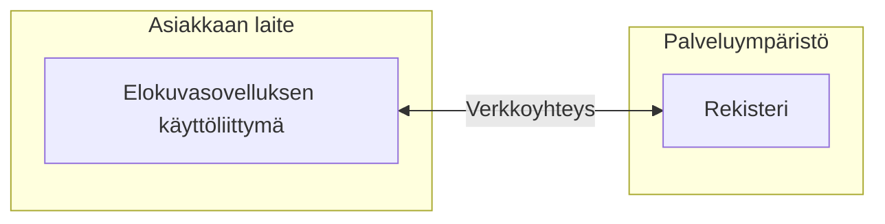
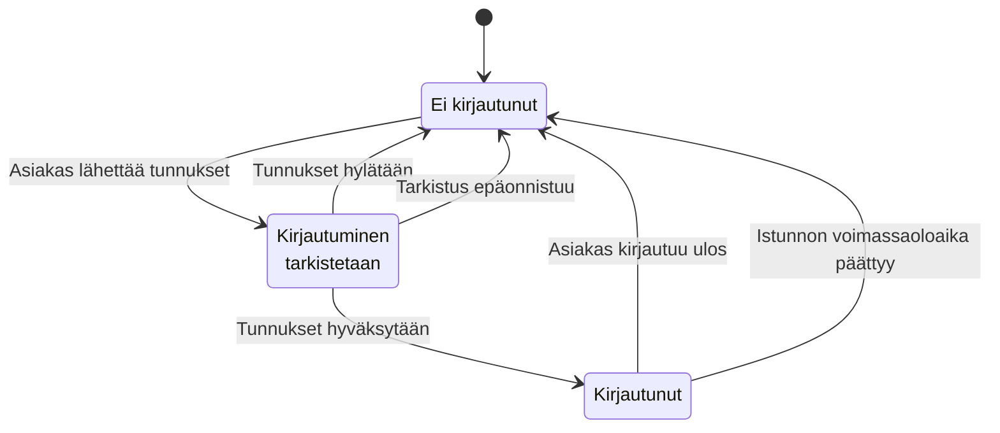

```mermaid
flowchart LR
    subgraph StudentDevice["Asiakkaan laite"]
        UserInterface["Elokuvasovelluksen käyttöliittymä"]
    end

    subgraph ServiceEnvironment["Palveluympäristö"]
        RegistryService["Rekisteri"]
    end

    UserInterface <-->|"Verkkoyhteys"| RegistryService
```
**KIRJAUTUMiNEN*

```mermaid
stateDiagram-v2
    state "Ei kirjautunut" as LoggedOut
    state "Kirjautuminen<br/>tarkistetaan" as CheckingLogin
    state "Kirjautunut" as LoggedIn

    [*] --> LoggedOut
    LoggedOut --> CheckingLogin: Asiakas lähettää tunnukset
    CheckingLogin --> LoggedIn: Tunnukset hyväksytään
    CheckingLogin --> LoggedOut: Tunnukset hylätään
    CheckingLogin --> LoggedOut: Tarkistus epäonnistuu
    LoggedIn --> LoggedOut: Asiakas kirjautuu ulos
    LoggedIn --> LoggedOut: Istunnon voimassaoloaika päättyy
```